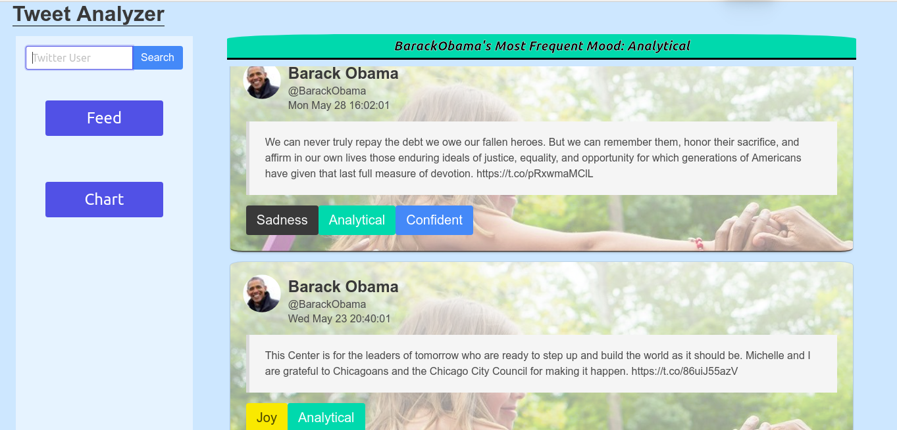
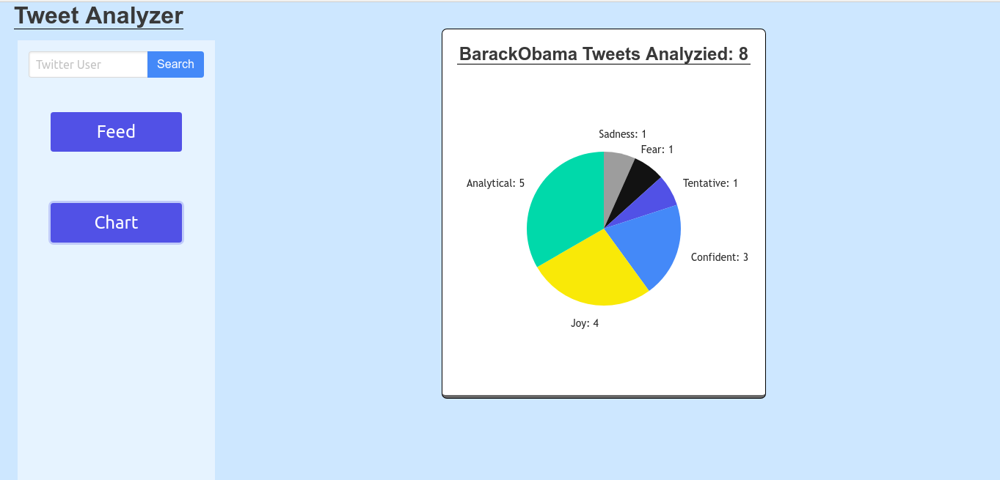
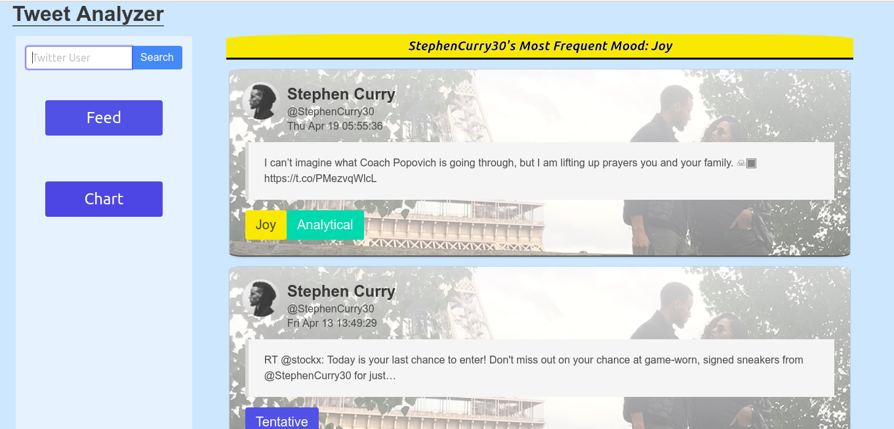
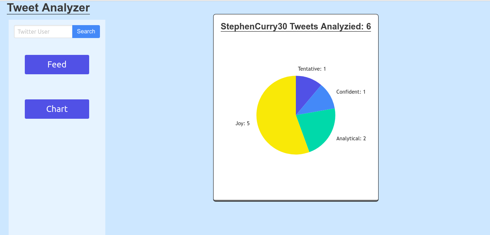

# tweetAnalizer
Search a twitter user and see each tweet's tone analyzied as well as what the most common tone the user had overall.
##### Feed view with twitter user "barrackobama" searched

##### Chart view with twitter user "barrackobama" searched

##### Feed view with twitter user "stephencurry30" searched

##### Chart view with twitter user "stephencurry30" searched

